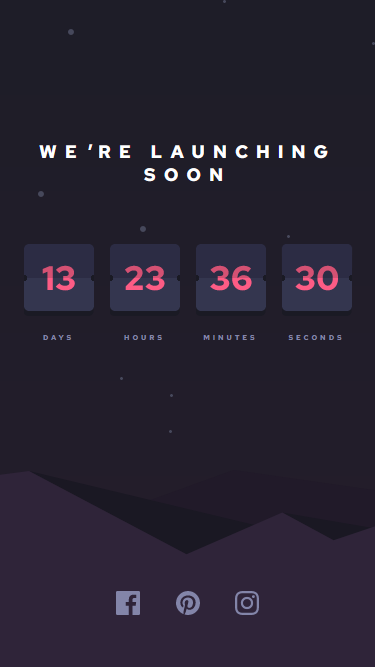
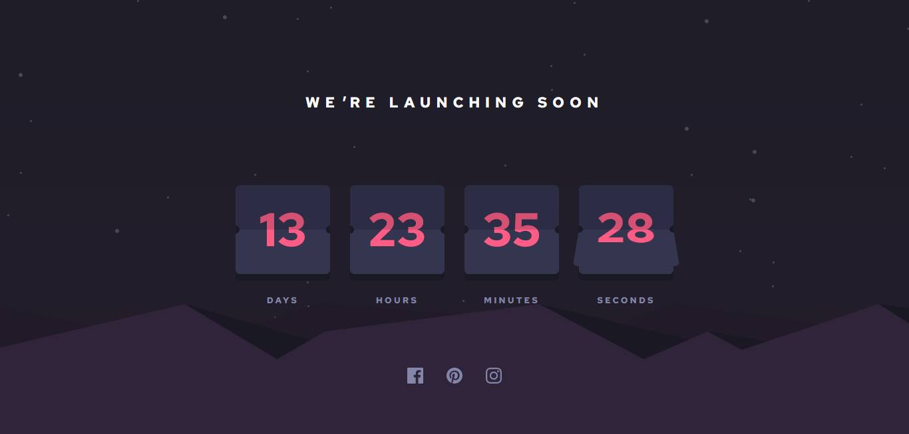

# Frontend Mentor - Launch countdown timer solution

This is a solution to the [Launch countdown timer challenge on Frontend Mentor](https://www.frontendmentor.io/challenges/launch-countdown-timer-N0XkGfyz-). Frontend Mentor challenges help you improve your coding skills by building realistic projects. 

## Table of contents

- [Overview](#overview)
  - [The challenge](#the-challenge)
  - [Screenshot](#screenshot)
  - [Links](#links)
- [My process](#my-process)
  - [Built with](#built-with)
  - [What I learned](#what-i-learned)
  - [Useful resources](#useful-resources)
- [Author](#author)

## Overview

### The challenge

Users should be able to:

- See hover states for all interactive elements on the page
- See a live countdown timer that ticks down every second (start the count at 14 days)
- **Bonus**: When a number changes, make the card flip from the middle

### Screenshot




### Links

- Solution URL: [https://github.com/exenestecnico/fm-launch-countdown/](https://github.com/exenestecnico/fm-launch-countdown/)
- Live Site URL: [https://exenestecnico.github.io/fm-launch-countdown/](https://exenestecnico.github.io/fm-launch-countdown/)

## My process

### Built with

- Semantic HTML5 markup
- CSS custom properties
- Flexbox
- Mobile-first workflow
- Web Components

### What I learned

Learned about making custom web components to encapsulate and reuse functionality.
Made a `<vertical-flip-card>` component and used it for each count.

```html
<div id="countdown">
  <div class="count">
    <vertical-flip-card id="days"></vertical-flip-card>
    <span>Days</span>
  </div>

  <div class="count">
    <vertical-flip-card id="hours"></vertical-flip-card>
    <span>Hours</span>
  </div>

  <div class="count">
    <vertical-flip-card id="minutes"></vertical-flip-card>
    <span>Minutes</span>
  </div>

  <div class="count">
    <vertical-flip-card id="seconds"></vertical-flip-card>
    <span>Seconds</span>
  </div>
</div>
```

### Useful resources

- [Web Components](https://developer.mozilla.org/en-US/docs/Web/Web_Components) - This is a good reference with examples, tutorials, and sample repos.
- [Intro to CSS 3D transforms](https://3dtransforms.desandro.com/card-flip) - Nice tutorials about CSS 3D Transforms.

## Author

- Frontend Mentor - [@evilhaxor](https://www.frontendmentor.io/profile/evilhaxor)
